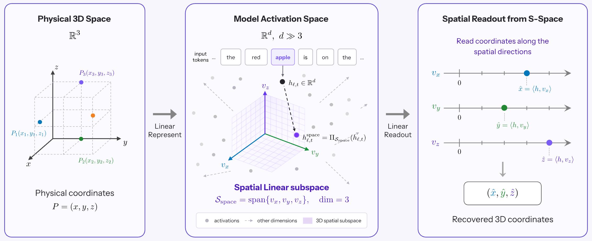
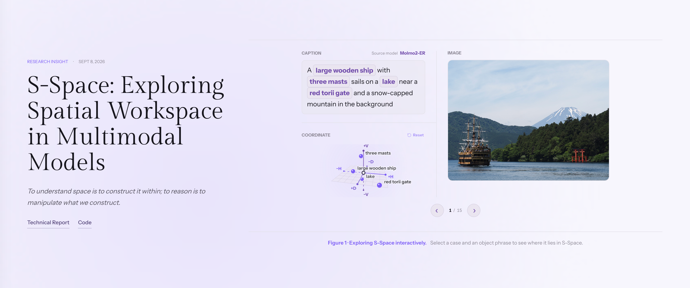

<p align="center">
  
</p>

<h1 align="center">S-Space</h1>
<p align="center">
  <b>Exploring Spatial Workspace in Multimodal Models</b>
</p>

<p align="center">
  <em>To understand space is to construct it within,
  to reason is to manipulate what we construct.</em>
</p>

<p align="center">
  <a href="https://mirros.ai/report/s-space.pdf"></a>
  <a href="https://mirros.ai/blog/s-space"></a>
  <a href="https://github.com/mirros-lab/s-space"></a>
  <a href="LICENSE"></a>
</p>

<p align="center">
  
</p>

## Overview

**S-Space is an internal spatial workspace in multimodal models.** We identify a three-dimensional linear subspace in intermediate activations that encodes continuous object positions along horizontal, vertical, and distance axes. This representation persists across prompts and multi-view contexts, integrates visual and linguistic information beyond visible objects, and can be causally manipulated to change spatial judgments.

Although models possess rich spatial representations, they do not always use them reliably: explicit computation over S-Space can outperform native reasoning. By examining how this workspace is shaped by supervision, transformed through reasoning, and refined by additional context, we provide a mechanistic perspective on spatial intelligence and a path toward more reliable spatial reasoning and action.

Code lives in `sspace/`; experiment settings live in `configs/`.

## News

<p align="center">
  <a href="https://mirros.ai/blog/s-space"></a>
</p>

- [2026/09/07] [MirroS Blog](https://mirros.ai/blog/s-space) and [Report](https://mirros.ai/report/s-space.pdf) is live.


## Get Started

The release includes pretrained S-Space axes and experiment commands for
Molmo2-ER, MolmoAct2-Pretrain, MolmoAct2, Qwen3.5-4B and Qwen3.6-27B.

### Installation

Use a CUDA host with `uv` installed; the installation command creates the three
model environments and downloads the main models and InstructPart auxiliary models.

```bash
git clone https://github.com/Manchery/s-space.git
cd s-space

./scripts/install.sh
```

Run the remaining commands from this directory. Launchers select the right
environment automatically; no manual activation is needed. Environments are
stored under `.envs/` and model weights under `.cache/assets/models/`.

### Prepare Datasets

Download and prepare COCO, SpatialTunnel, EmbSpatial, CV-Bench, SpinBench and
HStar:

```bash
./scripts/prepare_data.sh
```

Downloads are stored under `.cache/assets/` and benchmark-ready data under
`data/processed/`. Preparation reuses existing valid files.
The MMSI and InstructPart experiment commands below prepare their own data.
Experiment results are written under `outputs/`.

## Experiments

After setup, choose an experiment below and copy its command. The repository
already includes the required configurations; you do not need to write your own.

Evaluations reuse the released axes in `sspace/core/artifacts/pretrained/`;
rebuilding axes is optional.

### Construct S-Space

Learn S-Space axes on COCO-6000 and select readout layers on COCO-1800.

```bash
./scripts/run_experiment.sh --experiment sspace-construction
```

### Object Coordinates

Plot the relationship between S-Space coordinates and physical positions using saved COCO projections.

```bash
./scripts/plot_object_coordinates.sh
```

### Spatial QA

Compare native answers with S-Space readout on CV-Bench, EmbSpatial and SpatialTunnel.

```bash
./scripts/run_experiment.sh --suite benchmarks-generalization \
  --output-root outputs/reproduction/benchmarks
```

### Prompt Generalization

Test whether S-Space readout generalizes across pairwise, single-object and non-spatial prompts.

```bash
./scripts/run_experiment.sh --suite prompt-generalization \
  --output-root outputs/reproduction/prompts
```

### Multi-View Reasoning

Test whether S-Space follows the viewpoint specified by the prompt on HStar.

```bash
./scripts/run_experiment.sh --suite hstar \
  --output-root outputs/reproduction/multiview
```

### Spatial Interventions

Test whether editing S-Space changes spatial answers while preserving non-spatial judgments on EmbSpatial.

```bash
./scripts/run_experiment.sh --experiment spatial-causality
```

### Direction Coupling

Generate Qwen3.6-27B reasoning on MMSI and plot where its direction words lie in S-Space.

```bash
./scripts/run_experiment.sh --experiment direction-coupling
```

### Action Supervision

Compare part–whole spatial judgments across Molmo2-ER, MolmoAct2-Pretrain and MolmoAct2 on InstructPart.

```bash
./scripts/run_experiment.sh --experiment action_supervision
```

### Perspective Taking

Compare direct and chain-of-thought answers with S-Space readout and rotation on SpinBench, with and without the premise.

```bash
./scripts/run_experiment.sh --suite spinbench-direct \
  --output-root outputs/reproduction/spinbench-native

./scripts/run_experiment.sh --suite spinbench-projection \
  --output-root outputs/reproduction/spinbench-sspace
```

### CoT Evolution

Track how Qwen3.6-27B's spatial representations change across a supplied, gold-conditioned reasoning template on SpinBench.

```bash
./scripts/run_experiment.sh --experiment cot-evolution
```

### Context Scaling

Measure how adding the premise changes layerwise S-Space readout accuracy on SpinBench.

```bash
./scripts/run_experiment.sh --experiment context-scaling
```

## License

This project is licensed under the [Apache License 2.0](LICENSE).

## Acknowledgements

| Component | Projects |
|---|---|
| Models | [MolmoAct2](https://github.com/allenai/molmoact2), [Qwen](https://github.com/QwenLM/Qwen3.8) |
| Benchmarks | [SpatialTunnel](https://huggingface.co/datasets/cubec/spatialtunnel), [EmbSpatial-Bench](https://github.com/mengfeidu/EmbSpatial-Bench), [CV-Bench](https://huggingface.co/datasets/nyu-visionx/CV-Bench), [HStar](https://humanoid-vstar.github.io/), [SpinBench](https://huggingface.co/datasets/YuyouZhang/SpinBench) |
| Training data | [COCO](https://cocodataset.org/) |

## Citation

If you find S-Space useful, please cite:

```bibtex
@misc{mirros2026sspace,
    title  = {S-Space: Exploring Spatial Workspace in Multimodal Models},
    author = {{MirroS Team}},
    year   = {2026},
    month  = {September},
    url    = {https://mirros.ai/blog/s-space},
    note   = {Blog post}
}
```
